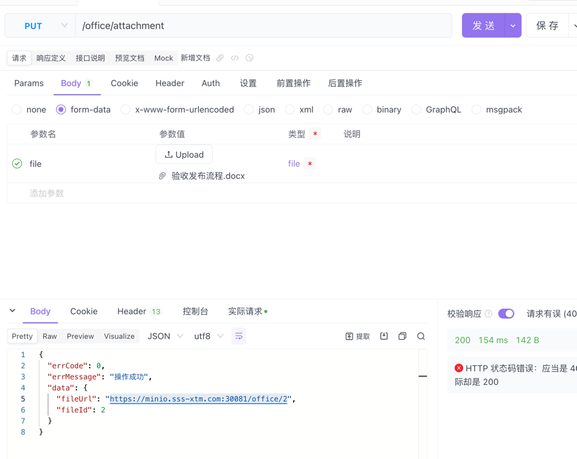
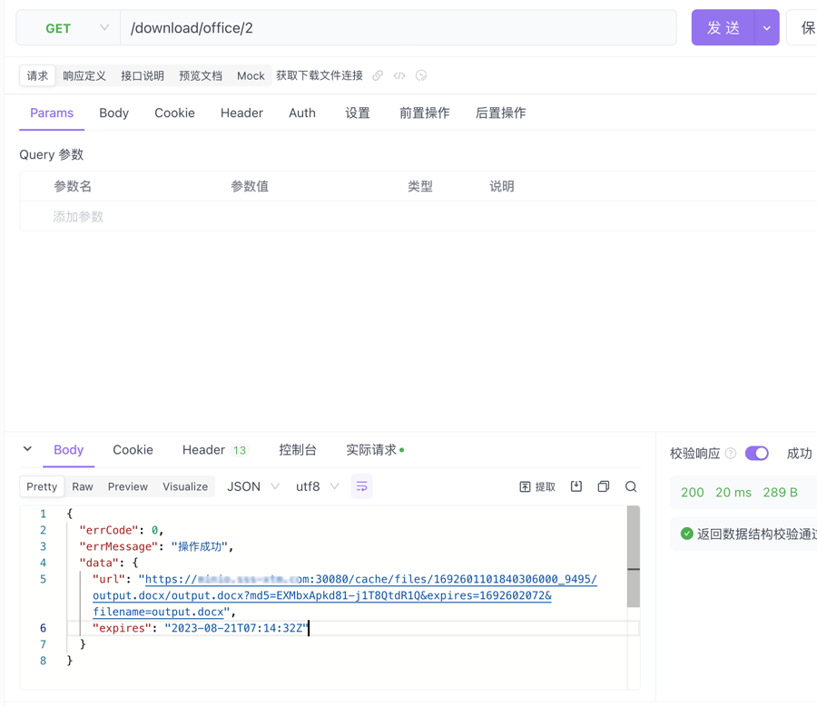
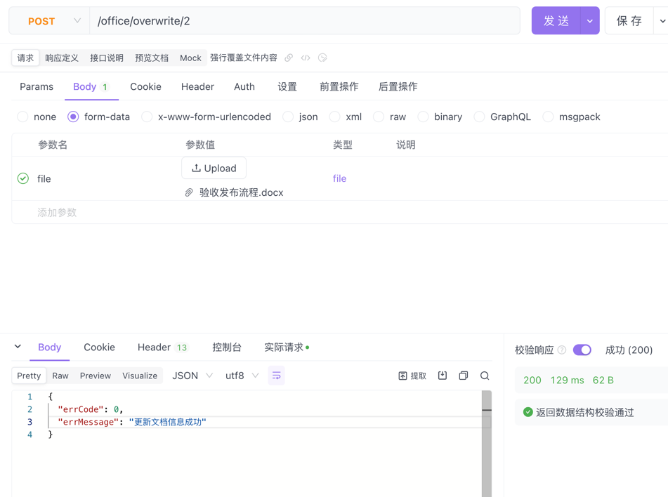

# onlyoffice-golang
基于golang go语言（beego框架）下的ONLYOFFICE Document Server二次开发。
主要功能为文档的上传、预览、覆盖、回调等功能。

#### 配置参数设置

|        环境变量         |           描述           | 是否必需  |
|:-------------------:|:----------------------:|:-----:|
|       dbHost        |         数据库地址          | true  |
|       dbName        |         数据库名称          | true  |
|       dbPort        |         数据库端口          | true  |
|       dbUser        |         数据库用户          | true  |
|     dbPassword      |         数据库密码          | true  |
|   documentServer    |       文档服务器外网地址        | true  |
| innerDocumentServer |       文档服务器内网地址        | false |
|      serverUrl      |     当前服务外网http访问地址     | true  |
|      wsServer       |  当前服务外网访websocket访问地址  | true  |
|     callBackUrl     | 文档服务器必需保存回调地址，建议填写内网地址 | true  |


#### 相关脚本
```bash
docker run -i -t -d --restart=always --name onlyoffice-documentServer-server -p 30080:80 -e REDIS_SERVER_HOST=192.168.10.239 -e REDIS_SERVER_PORT=6379 -e REDIS_SERVER_PASS=redis2020! -e DB_TYPE=postgres -e DB_HOST=192.168.10.240 -e DB_PORT=5432 -e DB_NAME=document -e DB_USER=postgres -e DB_PWD=Xtm@123456 douguohai/onlyoffice-documentserver:7.1.1.76

docker run --name postgres  --restart=always -e POSTGRES_PASSWORD=Xtm@123456 -e TZ=Asia/Shanghai -p 5432:5432 -d postgres:9.6

docker build -t douguohai/onlyoffice-golang:v11 . 

docker run -d -p 30081:8080 --restart=always -e serverUrl=https://p.sss-xtm.com:30081 -e wsServer=wss://p.sss-xtm.com:30081/ws -e documentServer=https://p.sss-xtm.com:30080 -e callBackUrl=http://192.168.10.241:30081 -e innerDocumentServer=http://192.168.10.241:30080  -e dbHost=192.168.10.240 -e dbPassword=Xtm@123456  -v /data/onlyoffice-golang/static:/app/static douguohai/onlyoffice-golang:v19

docker run -i -t -d --restart=always --name onlyoffice-documentServer-server -p 30080:80  douguohai/onlyoffice-documentserver:7.1.1.76
```

#### 上传文件，获取访问连接


#### 获取下载文档连接


#### 强行覆盖文件内容



docker run -d -p 30081:8080 --restart=always -e serverUrl=https://minio.sss-xtm.com:30081 -e wsServer=wss://minio.sss-xtm.com:30081/ws -e documentServer=https://minio.sss-xtm.com:30080 -e callBackUrl=http://192.168.10.241:30081 -e innerDocumentServer=http://192.168.10.241:30080  -e dbHost=192.168.10.240 -e dbPassword=Xtm@123456  -v /data/onlyoffice-golang/static:/app/static douguohai/onlyoffice-golang:v20


