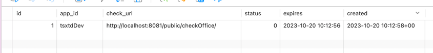
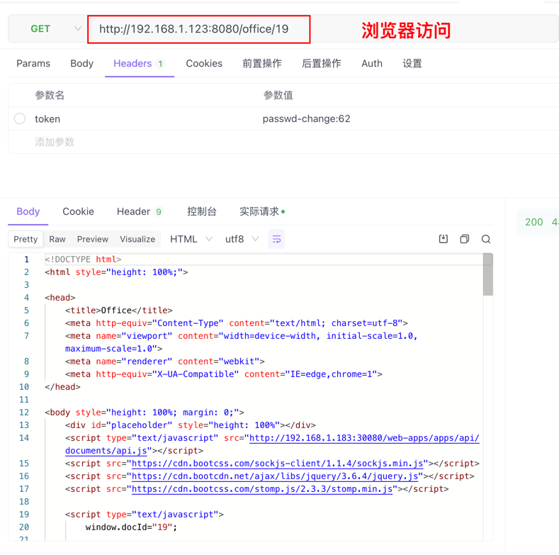

# onlyoffice-golang

基于golang go语言（beego框架）下的ONLYOFFICE Document Server二次开发。
主要功能为文档的上传、预览、覆盖、回调等功能。

#### 配置参数设置

|        环境变量         |           描述           | 是否必需  |
|:-------------------:|:----------------------:|:-----:|
|       dbHost        |         数据库地址          | true  |
|       dbName        |         数据库名称          | true  |
|       dbPort        |         数据库端口          | true  |
|       dbUser        |         数据库用户          | true  |
|     dbPassword      |         数据库密码          | true  |
|   documentServer    |       文档服务器外网地址        | true  |
| innerDocumentServer |       文档服务器内网地址        | false |
|      serverUrl      |     当前服务外网http访问地址     | true  |
|      wsServer       |  当前服务外网访websocket访问地址  | true  |
|     callBackUrl     | 文档服务器必需保存回调地址，建议填写内网地址 | true  |
|        auth         |     是否开启认证，默认false     | false |

#### 相关脚本

```bash
docker run -i -t -d --restart=always --name onlyoffice-documentServer-server -p 30080:80 -e REDIS_SERVER_HOST=192.168.10.239 -e REDIS_SERVER_PORT=6379 -e REDIS_SERVER_PASS=redis2020! -e DB_TYPE=postgres -e DB_HOST=192.168.10.240 -e DB_PORT=5432 -e DB_NAME=document -e DB_USER=postgres -e DB_PWD=Xtm@123456 douguohai/onlyoffice-documentserver:7.1.1.76

docker run --name postgres  --restart=always -e POSTGRES_PASSWORD=Xtm@123456 -e TZ=Asia/Shanghai -p 5432:5432 -d postgres:9.6

docker build -t douguohai/onlyoffice-golang:v11 . 

docker run -d -p 30081:8080 --restart=always -e serverUrl=https://p.sss-xtm.com:30081 -e wsServer=wss://p.sss-xtm.com:30081/ws -e documentServer=https://p.sss-xtm.com:30080 -e callBackUrl=http://192.168.10.241:30081 -e innerDocumentServer=http://192.168.10.241:30080  -e dbHost=192.168.10.240 -e dbPassword=Xtm@123456  -v /data/onlyoffice-golang/static:/app/static douguohai/onlyoffice-golang:v19

docker run -i -t -d --restart=always --name onlyoffice-documentServer-server -p 30080:80  douguohai/onlyoffice-documentserver:7.1.1.76
```

#### redisAuth 是否开启redis认证，默认false

> 认证机制，只做了简单的认证，即使用redis判断redis中是否存在该token的key,新增文件、覆盖文件、获取文件下载地址，需要在请求头添加Token和AppId；
> 预览文件时，为方便操作在请求连接上拼接字符串，如 http://192.168.1.123:8080/office/19?Token=passwd&AppId=app ;
> 注意 auth=true时，必须在数据库表app中配置相关应用，如下图配置(实际get
> 请求 http://localhost:8081/public/checkOffice/{Token})
> 当返回 {"code":200,"msg":""} 时允许访问，其他code !=200 则不允许访问



#### 上传文件，获取访问连接(auth=true，需要添加请求头Token和AppId)


#### 获取下载文档连接(auth=true，需要添加请求头Token和AppId)


#### 强行覆盖文件内容(auth=true，需要添加请求头Token和AppId)


#### 预览上传的文件(auth=true，连接需要拼接?Token=${Token}&AppId=${AppId})



docker run -d -p 30081:8080 --restart=always -e serverUrl=https://minio.sss-xtm.com:30081 -e dbName=doc -e wsServer=wss:
//minio.sss-xtm.com:30081/ws -e documentServer=https://minio.sss-xtm.com:30080 -e
callBackUrl=http://192.168.10.241:30081 -e innerDocumentServer=http://192.168.10.241:30080  -e dbHost=192.168.10.240 -e
dbPassword=Xtm@123456 -v /data/onlyoffice-golang/static:/app/static douguohai/onlyoffice-golang:v22

```bash
docker run -i -t -d --restart=always --name onlyoffice-documentServer -p 30080:80 -e REDIS_SERVER_HOST=192.168.110.202 -e REDIS_SERVER_PORT=6379 -e REDIS_SERVER_PASS=people2000 -e DB_TYPE=postgres -e DB_HOST=192.168.110.202 -e DB_PORT=5432 -e DB_NAME=document -e DB_USER=postgres -e DB_PWD=Xtm@123456 192.168.10.239:8888/charles0320/onlyoffice-documentserver:7.1.1.76
docker run -d -p 20080:8080 --restart=always -e serverUrl=https://trial.sss-xtm.com:20080 -e dbName=doc -e wsServer=wss://trial.sss-xtm.com:20080/ws -e documentServer=https://trial.sss-xtm.com:30080 -e callBackUrl=http://192.168.110.201:20080 -e innerDocumentServer=http://192.168.110.201:30080  -e dbHost=192.168.110.202 -e dbPassword=Xtm@123456  -v /data/onlyoffice-golang/static:/app/static douguohai/onlyoffice-golang:v22
docker run -p 9000:9000 -p 9090:9090  --name minio202  -d --restart=always -e "MINIO_ACCESS_KEY=xtmadmin"  -e "MINIO_SECRET_KEY=Xtm@123456" -v /data/minio-server/data:/data  -v /data/minio-server/config:/root/.minio minio/minio server  /data --console-address ":9090" -address ":9000"
```


